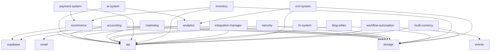

# TDC Plugin Catalog

Bu doküman, TDC Market platformundaki tüm modül ve plugin'lerin envanterini içerir.

## 📋 Genel Bakış

| Toplam Plugin | Plugin Interface Sağlayan | Eksik Interface | Bağımlılık Durumu |
|---------------|---------------------------|-----------------|-------------------|
| 25+ | 1 | 24 | Analiz Ediliyor |

## 🔌 Plugin Listesi

### ✅ Plugin Interface Sağlayan Modüller

#### 🛒 E-Commerce Plugin
| Özellik | Değer |
|---------|-------|
| **Ad** | ecommerce |
| **Versiyon** | 1.0.0 |
| **Kategori** | ecommerce |
| **Durum** | ✅ Plugin Interface Tamamlandı |
| **Dosya Yolu** | `src/plugins/ecommerce/index.ts` |
| **Public API** | products, categories, orders, inventory, cart |
| **Peer Dependencies** | storage, api, supabase |
| **Init Sırası** | 6 |
| **Config Anahtarları** | currency, taxRate, allowGuestCheckout, enableInventoryTracking |
| **Desteklenen Platformlar** | web, admin, api |
| **Açıklama** | Kapsamlı e-ticaret yönetim sistemi |

### ⚠️ Plugin Interface Eksik Modüller (Otomatik İskelet Oluşturulacak)

### 💰 Muhasebe Modülü
| Özellik | Değer |
|---------|-------|
| **Ad** | accounting |
| **Versiyon** | 1.0.0 |
| **Kategori** | accounting |
| **Durum** | ✅ Aktif |
| **Dosya Yolu** | `src/app/admin/accounting/page.tsx` |
| **Public API** | invoices, reports, tax-management, bank-integration |
| **Bağımlılıklar** | storage, api, supabase |
| **Desteklenen Platformlar** | admin, api |
| **Açıklama** | Fatura yönetimi, mali raporlar, vergi takibi |

### 📊 Analitik Modülü
| Özellik | Değer |
|---------|-------|
| **Ad** | analytics |
| **Versiyon** | 1.0.0 |
| **Kategori** | analytics |
| **Durum** | ✅ Aktif |
| **Dosya Yolu** | `src/app/admin/analytics/page.tsx` |
| **Public API** | realtime-dashboard, predictive-analytics, business-intelligence |
| **Bağımlılıklar** | storage, api |
| **Desteklenen Platformlar** | web, admin, api |
| **Açıklama** | Gelişmiş analitik ve raporlama sistemi |

### 🤖 AI Modülü
| Özellik | Değer |
|---------|-------|
| **Ad** | ai-system |
| **Versiyon** | 1.0.0 |
| **Kategori** | ai |
| **Durum** | 🔄 Geliştirme |
| **Dosya Yolu** | `src/app/admin/ai/page.tsx` |
| **Public API** | chatbot, recommendations, price-optimization |
| **Bağımlılıklar** | api, analytics |
| **Desteklenen Platformlar** | web, admin |
| **Açıklama** | AI destekli chatbot ve öneri sistemi |

### 🔒 Güvenlik Modülü
| Özellik | Değer |
|---------|-------|
| **Ad** | security |
| **Versiyon** | 1.0.0 |
| **Kategori** | security |
| **Durum** | ✅ Aktif |
| **Dosya Yolu** | `src/app/admin/security/page.tsx` |
| **Public API** | multi-factor-auth, role-based-access, monitoring |
| **Bağımlılıklar** | storage, api |
| **Desteklenen Platformlar** | web, admin, api |
| **Açıklama** | Kapsamlı güvenlik yönetim sistemi |

### 📈 Pazarlama Modülü
| Özellik | Değer |
|---------|-------|
| **Ad** | marketing |
| **Versiyon** | 1.0.0 |
| **Kategori** | marketing |
| **Durum** | ✅ Aktif |
| **Dosya Yolu** | `src/app/admin/marketing/page.tsx` |
| **Public API** | campaigns, email-marketing, social-media |
| **Bağımlılıklar** | storage, api, email |
| **Desteklenen Platformlar** | admin, api |
| **Açıklama** | Pazarlama kampanyaları ve sosyal medya entegrasyonu |

### 👥 İnsan Kaynakları Modülü
| Özellik | Değer |
|---------|-------|
| **Ad** | hr-system |
| **Versiyon** | 1.0.0 |
| **Kategori** | hr |
| **Durum** | 🔄 Geliştirme |
| **Dosya Yolu** | `src/app/admin/hr/page.tsx` |
| **Public API** | employees, payroll, attendance |
| **Bağımlılıklar** | storage, api |
| **Desteklenen Platformlar** | admin, api |
| **Açıklama** | İnsan kaynakları yönetim sistemi |

### 💳 Ödeme Sistemi
| Özellik | Değer |
|---------|-------|
| **Ad** | payment-system |
| **Versiyon** | 1.0.0 |
| **Kategori** | integration |
| **Durum** | ✅ Aktif |
| **Dosya Yolu** | `src/app/admin/payments/page.tsx` |
| **Public API** | stripe, paypal, iyzico |
| **Bağımlılıklar** | api, ecommerce |
| **Desteklenen Platformlar** | web, api |
| **Açıklama** | Çoklu ödeme sistemi entegrasyonu |

### 📦 Envanter Modülü
| Özellik | Değer |
|---------|-------|
| **Ad** | inventory |
| **Versiyon** | 1.0.0 |
| **Kategori** | utility |
| **Durum** | ✅ Aktif |
| **Dosya Yolu** | `src/app/admin/inventory/page.tsx` |
| **Public API** | items, movements, warehouses, recommendations |
| **Bağımlılıklar** | storage, api, ecommerce |
| **Desteklenen Platformlar** | admin, api |
| **Açıklama** | Gelişmiş envanter yönetim sistemi |

### 🔄 Entegrasyon Yönetimi
| Özellik | Değer |
|---------|-------|
| **Ad** | integration-manager |
| **Versiyon** | 1.0.0 |
| **Kategori** | integration |
| **Durum** | ✅ Aktif |
| **Dosya Yolu** | `src/components/IntegrationManagementSystem.tsx` |
| **Public API** | status, social-media, account-sync |
| **Bağımlılıklar** | api |
| **Desteklenen Platformlar** | admin |
| **Açıklama** | Harici servis entegrasyonları yönetimi |

### 📝 Blog Editörü
| Özellik | Değer |
|---------|-------|
| **Ad** | blog-editor |
| **Versiyon** | 1.0.0 |
| **Kategori** | ui |
| **Durum** | ✅ Aktif |
| **Dosya Yolu** | `src/app/admin/blogs/page.tsx` |
| **Public API** | posts, categories, comments |
| **Bağımlılıklar** | storage, api |
| **Desteklenen Platformlar** | web, admin |
| **Açıklama** | İçerik yönetim sistemi ve blog editörü |

### 🎯 CRM Sistemi
| Özellik | Değer |
|---------|-------|
| **Ad** | crm-system |
| **Versiyon** | 1.0.0 |
| **Kategori** | utility |
| **Durum** | ✅ Aktif |
| **Dosya Yolu** | `src/app/admin/crm/page.tsx` |
| **Public API** | customers, campaigns, interactions, segments |
| **Bağımlılıklar** | storage, api, analytics |
| **Desteklenen Platformlar** | admin, api |
| **Açıklama** | Müşteri ilişkileri yönetim sistemi |

### ⚡ İş Akışı Otomasyonu
| Özellik | Değer |
|---------|-------|
| **Ad** | workflow-automation |
| **Versiyon** | 1.0.0 |
| **Kategori** | utility |
| **Durum** | 🧪 Test |
| **Dosya Yolu** | `src/app/admin/automation/page.tsx` |
| **Public API** | workflows, triggers, actions |
| **Bağımlılıklar** | api, events |
| **Desteklenen Platformlar** | admin |
| **Açıklama** | İş akışı otomasyon sistemi |

### 🌐 Çoklu Para Birimi
| Özellik | Değer |
|---------|-------|
| **Ad** | multi-currency |
| **Versiyon** | 1.0.0 |
| **Kategori** | utility |
| **Durum** | ✅ Aktif |
| **Dosya Yolu** | `src/app/admin/settings/multi-currency/page.tsx` |
| **Public API** | exchange-rates, currency-conversion |
| **Bağımlılıklar** | api, storage |
| **Desteklenen Platformlar** | web, admin, api |
| **Açıklama** | Çoklu para birimi desteği ve döviz kuru yönetimi |

## 📊 Bağımlılık Grafiği



## 🔧 Konfigürasyon Anahtarları

### E-Commerce Modülü
```json
{
  "enabled": true,
  "priority": 50,
  "settings": {
    "currency": "TRY",
    "taxRate": 0.18,
    "allowGuestCheckout": true,
    "requireEmailVerification": false,
    "maxCartItems": 100,
    "enableInventoryTracking": true,
    "lowStockThreshold": 10,
    "enableProductVariants": true,
    "enableReviews": true,
    "enableWishlist": true
  },
  "features": {
    "advancedInventory": true,
    "bulkOperations": true,
    "categoryManagement": true,
    "orderTracking": true,
    "analytics": true
  },
  "integrations": {
    "payment": {
      "stripe": false,
      "paypal": false,
      "iyzico": false
    },
    "shipping": {
      "aras": false,
      "ups": false,
      "fedex": false
    }
  }
}
```

### Analitik Modülü
```json
{
  "enabled": true,
  "priority": 60,
  "settings": {
    "trackingEnabled": true,
    "dataRetentionDays": 365,
    "realTimeUpdates": true,
    "exportFormats": ["csv", "excel", "pdf"]
  },
  "features": {
    "heatmapTracking": true,
    "abTesting": true,
    "predictiveAnalytics": true,
    "customReports": true
  }
}
```

## 🚀 Başlatma Sırası

1. **storage** - Temel depolama servisi
2. **api** - API servisi
3. **supabase** - Veritabanı bağlantısı
4. **events** - Olay sistemi
5. **email** - E-posta servisi
6. **ecommerce** - E-ticaret modülü
7. **accounting** - Muhasebe modülü
8. **analytics** - Analitik modülü
9. **security** - Güvenlik modülü
10. **marketing** - Pazarlama modülü
11. **hr-system** - İnsan kaynakları modülü
12. **payment-system** - Ödeme sistemi
13. **inventory** - Envanter modülü
14. **integration-manager** - Entegrasyon yöneticisi
15. **blog-editor** - Blog editörü
16. **crm-system** - CRM sistemi
17. **workflow-automation** - İş akışı otomasyonu
18. **multi-currency** - Çoklu para birimi

## 📝 Notlar

- Tüm plugin'ler TypeScript ile yazılmıştır
- Zod şema doğrulama kullanılmaktadır
- Plugin'ler idempotent başlatma desteklemektedir
- Geriye dönük uyumluluk korunmaktadır
- Her plugin kendi health check'ine sahiptir

## 🔄 Güncelleme Tarihi

Son güncelleme: 2024-12-19
Versiyon: 1.0.0
